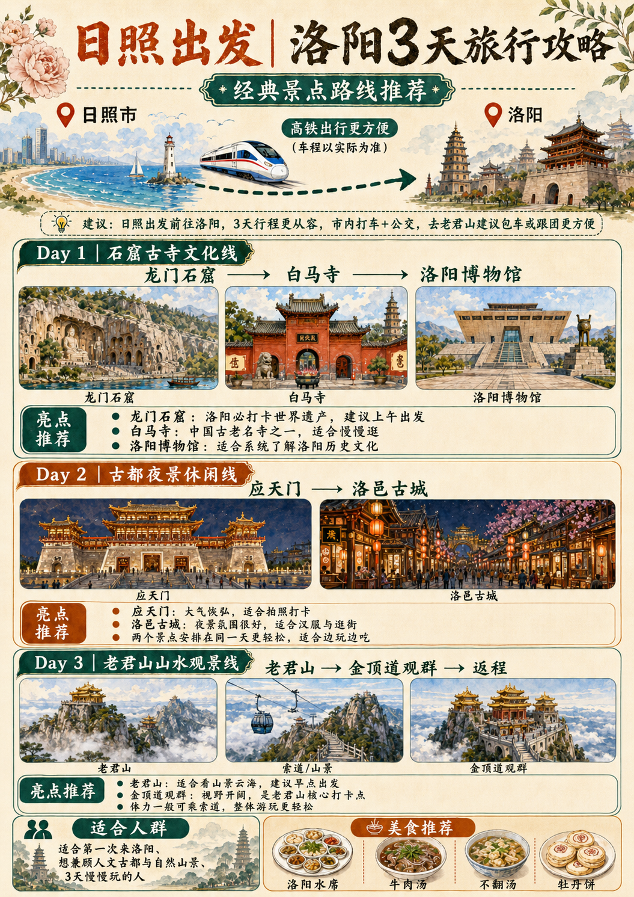
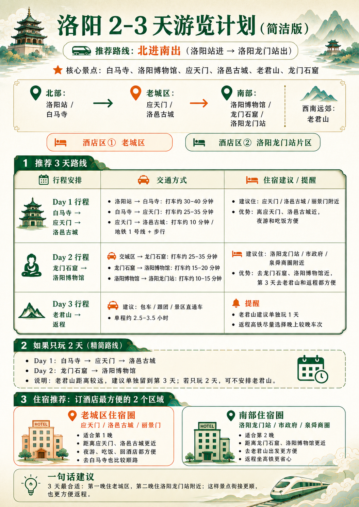
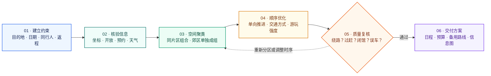

# 🧭 TravelPilot Agent Skills

<p align="center">
  <strong>把“想去哪里、玩几天”，变成真正能执行的旅行日程。</strong>
</p>

<p align="center">
  <a href="./VERSION"></a>
  <a href="./LICENSE"></a>
  
  
</p>

<p align="center">
  中文旅行规划 Agent Skill · 少折返路线 · 动态信息核验 · 确定性质量检查 · SVG 行程信息图
</p>

---

## ✨ 项目简介

**TravelPilot** 是一个可移植的旅行规划 Agent Skill。用户即使只输入“洛阳，3 天”，Agent 也能在合理默认条件下直接生成初版方案，包括每天去哪、先后顺序、景点间交通、住宿区域、美食、预算、天气提醒和备用路线。

它不是简单罗列热门景点，而是先研究景点开放条件、空间位置和交通关系，再按城市片区组织行程，尽量减少跨城折返和无效通勤。最终计划还会通过 Schema、证据、路线、强度、预算与返程检查，降低 Agent “看起来规划好了，实际上无法执行”的风险。✅

<table>
  <tr>
    <td align="center" valign="top" width="50%">
      <br>
      <sub><strong>📜 完整行程版</strong></sub>
    </td>
    <td align="center" valign="top" width="50%">
      <br>
      <sub><strong>🧭 简洁路线版</strong></sub>
    </td>
  </tr>
</table>

<p align="center"><sub>🎨 AI 行程视觉示例：用于直观展示路线与每日重点；实际开放时间、票价、预约和交通信息仍以出行前核验结果为准。</sub></p>

## 🚀 主要功能

| 能力 | TravelPilot 可以做什么 |
| --- | --- |
| 🗓️ 自动排程 | 生成 Day 1、Day 2、Day 3……上午、下午和晚间的完整行程 |
| 🗺️ 空间聚类 | 按老城、城北、城南、郊区等片区安排邻近景点，减少来回折腾 |
| 🚇 交通规划 | 比较步行、公交、地铁、打车等方式，估算距离、耗时与换乘成本 |
| ⭐ 景点分级 | 区分必去、推荐和可选景点，并支持“一定想去”与“不想去”约束 |
| 🏨 住宿建议 | 推荐方便串联主要路线、车站或机场的住宿区域，而非随意推荐单一酒店 |
| 🍜 顺路餐饮 | 推荐当地特色美食及当天路线附近适合用餐的区域 |
| 🎫 动态核验 | 查询门票、开放时间、预约要求及临时关闭信息，并记录证据来源 |
| 🌦️ 天气适配 | 通过 Open-Meteo 查询近期天气，根据下雨、高温和大风调整行程 |
| 👨‍👩‍👧 人群适配 | 支持老人、儿童、情侣、朋友，以及轻松游、正常游、特种兵游 |
| 💰 分类预算 | 估算住宿、餐饮、市内交通、门票、大交通与机动费用 |
| 🧳 实用提醒 | 生成衣物、雨具、防晒、行李寄存、医疗与紧急服务提示 |
| 🔁 备用方案 | 为雨天、闭馆、恶劣天气或提前返程准备可替换路线 |
| 🖼️ 可视化输出 | 生成 SVG 行程信息图，并可嵌入宿主 Agent 生成的 AI 城市封面 |

## 🧠 它如何规划少折返路线

### 从景点清单，到真正顺路的日程

TravelPilot 不直接按照热度把景点塞进行程，而是先建立旅行约束，再完成空间分组、交通比较和时间校验。路线只有通过最终质量复核，才会进入交付结果。



<table>
  <tr>
    <td width="25%" valign="top"><strong>📍 同片区优先</strong><br><sub>把距离近、交通方向一致的景点放在同一天。</sub></td>
    <td width="25%" valign="top"><strong>➡️ 单向推进</strong><br><sub>一天尽量沿一个方向移动，减少跨区往返。</sub></td>
    <td width="25%" valign="top"><strong>🚇 交通比较</strong><br><sub>综合时间、换乘、步行量与多人出行成本。</sub></td>
    <td width="25%" valign="top"><strong>🛡️ 最终复核</strong><br><sub>再次检查开放、强度、天气及末日返程余量。</sub></td>
  </tr>
</table>

> **路线思路示例**　✅ 城北相邻景点 → 城中景点 → 顺路夜景　　·　　❌ 城北 → 城南 → 再返回城北

对于老君山等交通成本较高的郊区或山岳景点，规划器会优先单独成组；最后一天则先锁定车站或机场的最晚到达时间，再倒推可安排的景点和离场时间。

## 🖼️ 效果与目的地示例

<table>
  <tr>
    <td align="center" valign="top" width="25%">
      <br>
      <strong>🏛️ 龙门石窟</strong><br>
      <sub>世界文化遗产</sub>
    </td>
    <td align="center" valign="top" width="25%">
      <br>
      <strong>🏺 洛阳博物馆</strong><br>
      <sub>城市历史总览</sub>
    </td>
    <td align="center" valign="top" width="25%">
      <br>
      <strong>🌙 应天门</strong><br>
      <sub>古都夜景地标</sub>
    </td>
    <td align="center" valign="top" width="25%">
      <br>
      <strong>⛰️ 老君山</strong><br>
      <sub>山岳自然景观</sub>
    </td>
  </tr>
</table>

> 📌 图片用于展示 TravelPilot 能处理的文化遗产、博物馆、城市夜景和山岳等不同旅行场景，不代表固定路线。Agent 会根据用户日期、出发地、同行人和实时信息重新规划。

## 💬 使用示例

最小输入——不强制追问：

```text
使用 $travel-planner 帮我规划洛阳三天行程。
```

带日期与同行人：

```text
使用 $travel-planner 规划 2026 年 10 月 2 日开始的西安四日游。
两名成年人带一名 8 岁儿童，正常强度，一定要去兵马俑，
第二天少走路，最后生成一张行程信息图。
```

修改已有方案：

```text
不去第二天的某某景点，换成一个室内亲子项目，
重新规划后检查是否绕路、是否过赶。
```

### Agent 输出通常包括：

📍 **每日行程：** 每天具体去哪、先去哪里、后去哪里；  
⏱️ **时间规划：** 建议到达时间、游玩时长与交通耗时；  
🏨 **住宿推荐：** 推荐住宿区域及其交通优势；  
🍲 **美食推荐：** 当地特色美食与顺路用餐区域；  
🎟️ **景点信息：** 门票、开放时间、预约与动态状态；  
💵 **旅行准备：** 分类预算、必备物品和避坑提醒；  
☔ **备用方案：** 雨天、闭馆及其他突发情况的备用方案。

## 📦 安装方法

### 1. 获取项目

要求 Python 3.9 或更高版本。核心能力只使用 Python 标准库，无需额外安装第三方 Python 包。

```bash
git clone https://github.com/mrsunjc/TravelPilot-agent-skills.git
cd TravelPilot-agent-skills
```

### 2. 安装到 Codex

Windows PowerShell：

```powershell
Copy-Item -Recurse -Force .\travel-planner "$env:USERPROFILE\.codex\skills\travel-planner"
```

macOS / Linux：

```bash
cp -R ./travel-planner ~/.codex/skills/travel-planner
```

### 3. 用于其他 Agent

将 `travel-planner/` 复制到目标 Agent 的 Skills 目录即可。宿主需要能够：

1. 读取 `SKILL.md`；
2. 按需加载 `references/`；
3. 执行 `scripts/` 中的 Python 脚本；
4. 在查询动态旅行信息时提供联网或浏览工具。

`agents/openai.yaml` 是 Codex/OpenAI 的可选界面元数据，其他平台可以忽略。高德 Web 服务属于可选地图能力；密钥必须由宿主通过 `AMAP_API_KEY` 安全提供，不能写入代码、README、日志或旅行计划。Open-Meteo 天气接口无需 API Key。

## 📁 目录结构

```text
TravelPilot-agent-skills/
├── README.md                    # GitHub 项目说明
├── LICENSE                      # MIT 开源许可证
├── VERSION                      # 当前版本
├── pyproject.toml               # Python 项目元数据
├── .gitignore                   # Git 忽略规则
├── assets/                      # 仓库展示资源
│   └── readme/
│       ├── travelpilot-luoyang-overview.png
│       ├── travelpilot-luoyang-compact-guide.png
│       ├── longmen-grottoes.png
│       ├── luoyang-museum.png
│       ├── yingtian-gate.png
│       └── laojun-mountain.png
├── travel-planner/              # 可直接安装的运行时 Skill
│   ├── SKILL.md                 # Agent 工作流与触发说明
│   ├── agents/                  # 可选宿主界面元数据
│   ├── references/              # 规划规则、研究与输出规范
│   ├── schemas/                 # 计划、交接与路线数据结构
│   ├── scripts/                 # 路线、天气、校验与可视化工具
│   └── tests/                   # Skill 单元测试及样例
├── tests/                       # 仓库级质量门测试
├── evals/                       # Gold 与 held-out 评测集
├── tools/                       # 评测运行工具
├── release/                     # 发布构建与一致性检查
└── .github/workflows/           # GitHub Actions CI
```

`travel-planner/` 是普通用户真正需要安装的 Skill；仓库外层的测试、评测、发布和 CI 文件用于研发与质量保障，不会增加每次旅行请求的上下文负担。

## 🛠️ 使用说明

### 验证结构化计划

```bash
python travel-planner/scripts/validate_plan.py final-plan.json
```

### 生成 SVG 行程信息图

```bash
python travel-planner/scripts/travel_visualizer.py final-plan.json \
  --output trip-overview.svg \
  --prompt-output cover-prompt.txt
```

如宿主 Agent 已生成 PNG、JPEG 或 WebP 城市封面，可嵌入信息图：

```bash
python travel-planner/scripts/travel_visualizer.py final-plan.json \
  --cover-image destination-cover.png \
  --output trip-overview.svg
```

### 运行测试与评测

```bash
python -m unittest discover -s tests -v
python -m unittest discover -s travel-planner/tests -v
python tools/run_evals.py evals/gold/cases.json
python tools/run_evals.py evals/heldout/cases.json
```

### 构建并检查发布包

```bash
python release/build_release.py --root . --output travel-planner-skill-v2.1.0.zip
python release/check_release.py --root . --archive travel-planner-skill-v2.1.0.zip
```

## 🛡️ 质量保障

TravelPilot 使用机器可验证的质量门约束旅行方案，而不是只依赖 Agent 自我判断：

✅ **数据结构校验：** JSON Schema 数据结构校验；  
🔗 **一致性检查：** 声明与证据一致性检查；  
🧾 **引用检查：** 引用与动态事实完整性检查；  
🚦 **路线检查：** 路线折返、交通时间和每日强度检查；  
💰 **预算检查：** 预算分类及合计一致性检查；  
🔄 **交接检查：** 跨模型、跨 Agent 交接结构检查；  
📦 **版本检查：** 源码、安装目录和发布 ZIP 的版本一致性检查；  
🧪 **自动评测：** Gold 与 held-out 评测集及 GitHub Actions 自动测试。

> ⚠️ 本项目不内置全国完整景点数据库，也不替代官方票务和公告系统。票价、开放时间、预约、天气与临时关闭属于动态事实，出发前应再次核验官方信息。

## 🗺️ 未来计划

- [ ] 扩大全国城市、县域与小众目的地评测覆盖；
- [ ] 增加海岛、边境、乡村、亲子、老年和无障碍场景；
- [ ] 接入更多合规地图与公共交通数据源；
- [ ] 强化官方公告、临时闭馆和预约政策的多来源交叉核验；
- [ ] 完善酒店区域评分、多人交通成本和分档预算模型；
- [ ] 增加 HTML、PDF、PNG 与日历格式导出；
- [ ] 支持更多语言与境外旅行规划规则。

## 📄 许可证与致谢

本项目采用 [MIT License](./LICENSE) 开源。你可以在保留版权和许可证声明的前提下使用、修改和分发本项目。

感谢以下项目、平台与社区提供的数据接口、工具和实践参考：

🌦️ **天气数据：** [Open-Meteo](https://open-meteo.com/)：免密钥天气数据；  
🗺️ **地图与地理编码：** 高德开放平台与 OpenStreetMap Nominatim：可选地理编码及路线能力；  
🐍 **开发生态：** Python 与 JSON Schema 生态；  
🤝 **社区支持：** 推动 Agent Skills 开放与互操作的开发者社区。  

外部服务仍受各自的许可、配额和使用条款约束。景点图片及 AI 示例图用于项目功能展示；公开发布前请确保所使用图片拥有相应授权。

---

<p align="center">
  如果这个项目对你有帮助，欢迎点亮 ⭐ Star、提交 Issue 或参与改进。<br>
  <strong>愿每一次出发，都少一点折返，多一点从容。🌏</strong>
</p>
